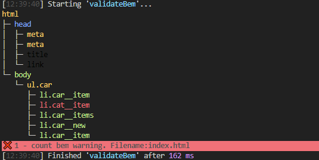

# Gulp tasks , function and packages

## Gulp tasks
- command `gulp`
    - `default = watching` is the main task, runs `build`, `browserSync` and `watchFiles`.
    - `build` Deleting `app` and `build` folders, then builds all files and folders, 
        - runs tasks `copy` and ( `compress` ), images, sprites: png, sprites: svg, pug, scss, js.
        - runs tasks imgsprite generate `sprite.png` and `_sprite.scss`
    - `browserSync` Starts the Browsersync server.
    - `watchFiles` Starts tracking files, so that when they change, they are automatically rebuilt.
```javascript
    1.  Deleting ' app ' and ` build ` folders.
    2.  Creating ` app ` and ` build ` folders and copy all nessesery files rom ` src `.
    3.  Starting ` browserSync `for real time visual see all changes in `*.html and other files` .
    4.  Waching all folders in ` src ` and if there some change copy all chanches, to destenations.
```
---

## Extra options:
#### ***`gulp favicon`*** command if need to creat ***`favicons`*** 
- `1` Copy file in `src/img`  folder.
- `2` File must be renamed to `favicon.` `png, jpg, jepg, svg `.
- `3` Use command `gulp favicon` to create files.
- `4` All necessary codes will auto field in all `*.html.`
- `5` If need only delete favicons use command `gulp delfavicon`.
- `6` If need only generate favicons use command `gulp faviconGenerate`.
- `7` If need only add meta ( insert favicon code ) in `*.html `use command `gulp faviconAddMeta`.

---

#### ***`gulp imgSprite`*** command if need to creat **` sprites`**  
- `1` Copy files in `src/img/sprite/png/`  folder.
- `2` Use command `gulp imgsprite` to generate and create in `src/img/sprite/` `sprite.png` and in `src/scss/` `_sprite.scss` , files.
- `3` Using sprite ...
```scss
.myclass {

    @include sprite($sprite);
}
```
- `4` `$sprite` you can see all sprites variables in `_style.scss`.


---

## Installed Packages:
- For uninstall use command	
	- *`npm uninstall`* `(Package-Name)`  

- [browser-sync](#browser-sync)
- [gulp-watch](#gulp-watch)
- [gulp-sass](#gulp-sass)
- [gulp-autoprefixer](#gulp-autoprefixer)
- [gulp-autoprefixer](#gulp-sourcemaps)
- [scss watch](#scss_watch)
- [gulp-plumber / gulp-notify](#gulp-plumber_gulp-notify)
- [gulp-file-include](#gulp-file-include)
- [del](#del)
- [gulp-favicons](#gulp-favicons)


- [gulp-shorthand](#gulp-shorthand)
- [gulp-w3c-html-validator](#gulp-w3c-html-validator)
- [gulp-html-bem-validator](#gulp-html-bem-validator)
- [through2](#through2)
- [pugLinter](#pugLinter)
---

#### **browser-sync**

Browser-sync to keep multiple browsers & devices in sync when building websites.

gulpfile.js
```javascript
const gulp = require('gulp'); // Connecting gulp
const browserSync = require('browser-sync').create();
gulp.task('server', function () {
browserSync.init({
server: {
baseDir: "./build/"
}
})
});
```

We can use **`browser-sync`** by command
`browser-sync`
For more information [this link](https://www.npmjs.com/package/browser-sync).


#### **gulp-watch**

***Watching Files***

The watch() API connects globs to tasks using a file system watcher. It watches for changes to files that match the globs and executes the task when a change occurs


gulpfile.js
```javascript
const gulp        = require('gulp');
const browserSync = require('browser-sync').create();
const watch       = require('gulp-watch');
gulp.task('watch', function() {
    watch('./build/*.html', gulp.parallel(browserSync.reload))
});
gulp.task('server', function() {
    browserSync.init({
        server: {
            baseDir: "./build/"
        }
    })
});
gulp.task('default', gulp.parallel('server', 'watch'));
```
We can use **`gulp-watch`** by command
`gulp watch`

For more information [this link](https://www.npmjs.com/package/gulp-watch).

#### **gulp-sass**


Sass is a preprocessor scripting language that is interpreted or compiled into Cascading Style Sheets (CSS). Sass has two syntaxes; the older syntax uses indentation to separate code blocks and newline characters to separate rules.

The newer syntax, SCSS, uses block formatting like CSS. It uses braces to denote code blocks and semicolons to separate lines within a block. The indented syntax and SCSS files are traditionally given the extensions .sass and .scss, respectively.


gulpfile.js
```javascript
const sass = require('gulp-sass');
gulp.task('scss', function (callback) {
return gulp.src("./build/scss/style.scss")
.pipe(sass())
.pipe( gulp.dest("./build/css/") );
callback();
});
```

We can use **`gulp-sass`** by command
`gulp sass`

For more information [this link](https://www.npmjs.com/package/gulp-sass).


#### **gulp-autoprefixer**

Autoprefixer is able to cut down on a lot of the workload involved in making our grids IE-compatible, it can’t fix everything. It can only translate things that IE can understand. These are the many critical things that you need to be aware of if you don’t want to open the site up in IE one day and have it blow up in your face.

gulpfile.js
```javascript
const autoprefixer = require('gulp-autoprefixer');
gulp.task('scss', function (callback) {
return gulp.src("./build/scss/style.scss")
.pipe(sass())
.pipe(autoprefixer({
overrideBrowserslist: ['last 3 versions']
}))
.pipe( gulp.dest("./build/css/") );
callback();
});
```


For more information [this link](https://www.npmjs.com/search?q=gulp-autoprefixer).

#### **gulp-sourcemaps**

It automatically creates source maps from your code. A source map is used to tell you which file and line in your original code a part of minified code comes from. So sourcemaps can be very helpful when debugging minified Angular apps in the browser

gulpfile.js
```javascript
const sourcemaps = require('gulp-sourcemaps');
gulp.task('scss', function (callback) {
return gulp.src("./build/scss/style.scss")
.pipe(sourcemaps.init())
.pipe(sass())
.pipe(autoprefixer({
overrideBrowserslist: ['last 3 versions']
}))
.pipe(sourcemaps.write())
.pipe( gulp.dest("./build/css/") );
callback();
});
```


For more information [this link](https://www.npmjs.com/package/gulp-sourcemaps).


#### **scss_watch**

 It's what converts your Sass files into CSS and auto-compiles your Sass every time it changes. Following is a more general command that looks for your Sass files and watches for changes inside the directory containing your Sass files: sass --watch .

gulpfile.js
```javascript
gulp.task('watch', function () {
watch(['./build/*.html', './build/css/*.css'], gulp.parallel(browserSync.reload))
watch('./build/scss/**/*.scss', gulp.parallel('scss'))
});
gulp.task('default', gulp.parallel('server', 'watch', 'scss'));

```


#### **gulp-plumber_gulp-notify**

gulp-plumber which generates error output. But this does not interrupt the work of Gulp.

gulp-notify when called with a string message will output that message for every file present in the passed stream so, in the final task of the example, it will be called twice.


gulpfile.js
```javascript
const notify = require('gulp-notify');
const plumber = require('gulp-plumber');
gulp.task('scss', function (callback) {
return gulp.src("./build/scss/style.scss")
.pipe( plumber({
errorHandler: notify.onError(function(err){
return {
title: 'Styles',
sound: false,
message: err.message
}
})
}))
.pipe(sourcemaps.init())
.pipe(sass())
……...
```


For more information gulp-plumber [this link](https://www.npmjs.com/package/gulp-plumber).
For more information gulp-notify [this link](https://www.npmjs.com/package/gulp-notifyr).


#### **gulp-file-include**

For include *.html files in index.html

gulpfile.js
```javascript
const fileinclude = require('gulp-file-include');
gulp.task('html', function(callback) {
return gulp.src('./build/*.html')
.pipe( plumber({
errorHandler: notify.onError(function(err){
return {
title: 'HTML include',
sound: false,
message: err.message
}
})
}))
.pipe( fileinclude({ prefix: '@@' }) )
.pipe( gulp.dest('./app/') )
callback();
});
```


For more information [this link](https://www.npmjs.com/package/gulp-file-include).


#### **del**

Delete files and directories 'app'  'build'

gulpfile.js
```javascript
const del = require('del');
gulp.task('clean:build', function () {
return del('./build')
})
gulp.task('default',
gulp.series(
gulp.parallel('clean:build')
gulp.parallel('html', 'scss', 'copy:js', 'copy:img'),
gulp.parallel('server', 'watch')
)
);
```


For more information [this link](https://www.npmjs.com/package/del).


#### **gulp-favicons**

For generating favicons and their associated files.

gulpfile.js
```javascript
const favicons = require("favicons").stream;
const log = require("fancy-log");

gulp.task("favicon", function () {
  return gulp.src([source_folder + '/img/favicon.png'])
    .pipe(favicons({
      path: "/img/favicon/",                                // Path for overriding default icons path. `string`
      appName: null,                            // Your application's name. `string`
      appShortName: null,                       // Your application's short_name. `string`. Optional. If not set, appName will be used
      appDescription: null,                     // Your application's description. `string`
      developerName: null,                      // Your (or your developer's) name. `string`
      developerURL: null,                       // Your (or your developer's) URL. `string`
      dir: "auto",                              // Primary text direction for name, short_name, and description
      lang: "en-US",                            // Primary language for name and short_name
      background: "#fff",                       // Background colour for flattened icons. `string`
      theme_color: "#fff",                      // Theme color user for example in Android's task switcher. `string`
      appleStatusBarStyle: "black-translucent", // Style for Apple status bar: "black-translucent", "default", "black". `string`
      display: "standalone",                    // Preferred display mode: "fullscreen", "standalone", "minimal-ui" or "browser". `string`
      orientation: "any",                       // Default orientation: "any", "natural", "portrait" or "landscape". `string`
      scope: "/",                               // set of URLs that the browser considers within your app
      start_url: "/?homescreen=1",              // Start URL when launching the application from a device. `string`
      version: "1.0",                           // Your application's version string. `string`
      logging: false,                           // Print logs to console? `boolean`
      pixel_art: false,                         // Keeps pixels "sharp" when scaling up, for pixel art.  Only supported in offline mode.
      loadManifestWithCredentials: false,       // Browsers don't send cookies when fetching a manifest, enable this to fix that. `boolean`
      url: null,
      html: "_favicon.html",
      pipeHTML: true,
      replace: true,
      icons: {
        // Platform Options:
        // - offset - offset in percentage
        // - background:
        //   * false - use default
        //   * true - force use default, e.g. set background for Android icons
        //   * color - set background for the specified icons
        //   * mask - apply mask in order to create circle icon (applied by default for firefox). `boolean`
        //   * overlayGlow - apply glow effect after mask has been applied (applied by default for firefox). `boolean`
        //   * overlayShadow - apply drop shadow after mask has been applied .`boolean`
        //
        android: true,              // Create Android homescreen icon. `boolean` or `{ offset, background, mask, overlayGlow, overlayShadow }` or an array of sources
        appleIcon: true,            // Create Apple touch icons. `boolean` or `{ offset, background, mask, overlayGlow, overlayShadow }` or an array of sources
        appleStartup: true,         // Create Apple startup images. `boolean` or `{ offset, background, mask, overlayGlow, overlayShadow }` or an array of sources
        coast: true,                // Create Opera Coast icon. `boolean` or `{ offset, background, mask, overlayGlow, overlayShadow }` or an array of sources
        favicons: true,             // Create regular favicons. `boolean` or `{ offset, background, mask, overlayGlow, overlayShadow }` or an array of sources
        firefox: true,              // Create Firefox OS icons. `boolean` or `{ offset, background, mask, overlayGlow, overlayShadow }` or an array of sources
        windows: true,              // Create Windows 8 tile icons. `boolean` or `{ offset, background, mask, overlayGlow, overlayShadow }` or an array of sources
        yandex: true                // Create Yandex browser icon. `boolean` or `{ offset, background, mask, overlayGlow, overlayShadow }` or an array of sources
      }
    }))
    .on("error", log)
    .pipe(dest([source_folder + '/img/favicon/']));
});
```


For more information [this link](https://www.npmjs.com/package/favicons).


#### **gulp-shorthand**

Makes your CSS files lighter and more readable.

gulpfile.js
```javascript
var gulp = require('gulp');
var shorthand = require('gulp-shorthand');
 
gulp.task('default', function () {
    return gulp.src('src/index.css')
        .pipe(shorthand())
        .pipe(gulp.dest('dest'));
});
```
```scss
// scss

.our {
	// .our__team-text

	&__team-text {
		background-image: url(../img/city.jpg);
		background-size: auto;
		background-repeat: no-repeat;
        background-position: center;
	}
```
```css
/* css */

.our__team-text {
  background: url(../img/city.jpg) no-repeat center/auto;
}
```

For more information [this link](https://www.npmjs.com/package/gulp-shorthand).


#### **gulp-w3c-html-validator**


 

gulpfile.js
```javascript
const gulp =          require('gulp');
const htmlValidator = require('gulp-w3c-html-validator');
 
// Tasks
const task = {
   validateHtml() {
      return gulp.src('target/**/*.html')
         .pipe(htmlValidator())
         .pipe(htmlValidator.reporter());
      },
   };
 
// Gulp
gulp.task('validate-html', task.validateHtml);
```


For more information [this link](https://www.npmjs.com/package/gulp-w3c-html-validator).


#### **gulp-html-bem-validator**


gulpfile.js
```javascript
var gulp = require('gulp');
var gulpHtmlBemValidator = require('gulp-html-bem-validator');
 
gulp.task('html-bem-validator', () => {
  gulp.src('pages/*.html')
    .pipe(gulpHtmlBemValidator())
    .pipe(gulp.dest('build/'));
});
```
```html
  <ul class="car">
      <li class="car__item"></li>
      <li class="cat__item"></li>
      <li class="car__items"></li>
      <li class="car__new"></li>
      <li class="car__item"></li>
    </ul>
```


For more information [this link](https://www.npmjs.com/package/gulp-html-bem-validator).

#### **through2**


gulpfile.js
```javascript
fs.createReadStream('ex.txt')
  .pipe(through2(function (chunk, enc, callback) {
    for (let i = 0; i < chunk.length; i++)
      if (chunk[i] == 97)
        chunk[i] = 122 // swap 'a' for 'z'
 
    this.push(chunk)
 
    callback()
   }))
  .pipe(fs.createWriteStream('out.txt'))
  .on('finish', () => doSomethingSpecial())
```


For more information [this link](https://www.npmjs.com/package/through2).

#### **pugLinter**


 

gulpfile.js
```javascript
const gulp = require('gulp');
const pugLinter = require('gulp-pug-linter');
 
gulp.task('lint:template', () => (
  gulp
    .src('./**/*.pug')
    .pipe(pugLinter({ failAfterError: true }))
));
```


For more information [this link](https://www.npmjs.com/package/gulp-pug-linter).


#### ** **


 

gulpfile.js
```javascript

```


For more information [this link]( ).


#### ** **


 

gulpfile.js
```javascript

```


For more information [this link]( ).

#### ** **


 

gulpfile.js
```javascript

```


For more information [this link]( ).